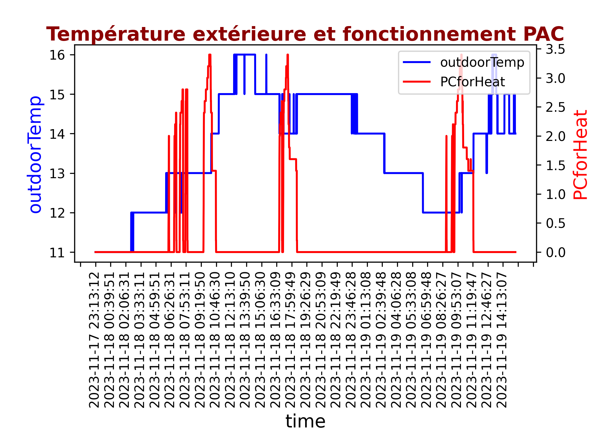
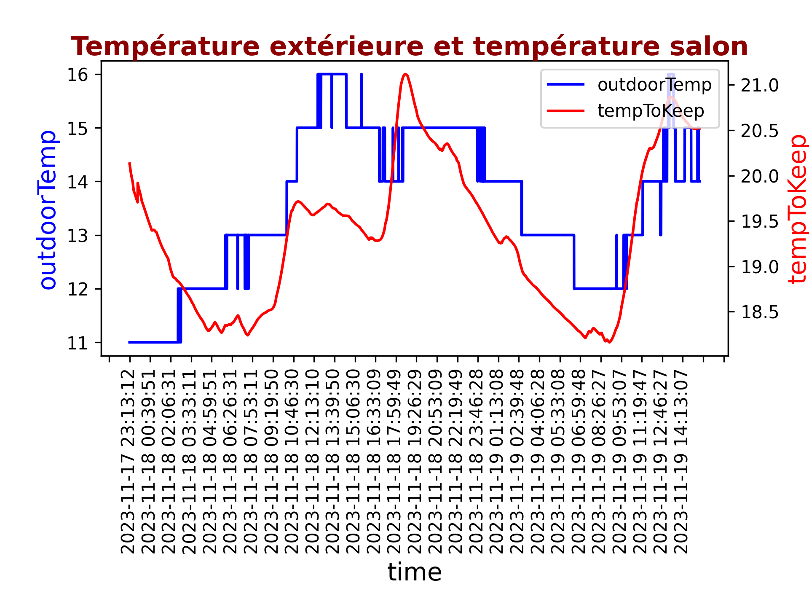
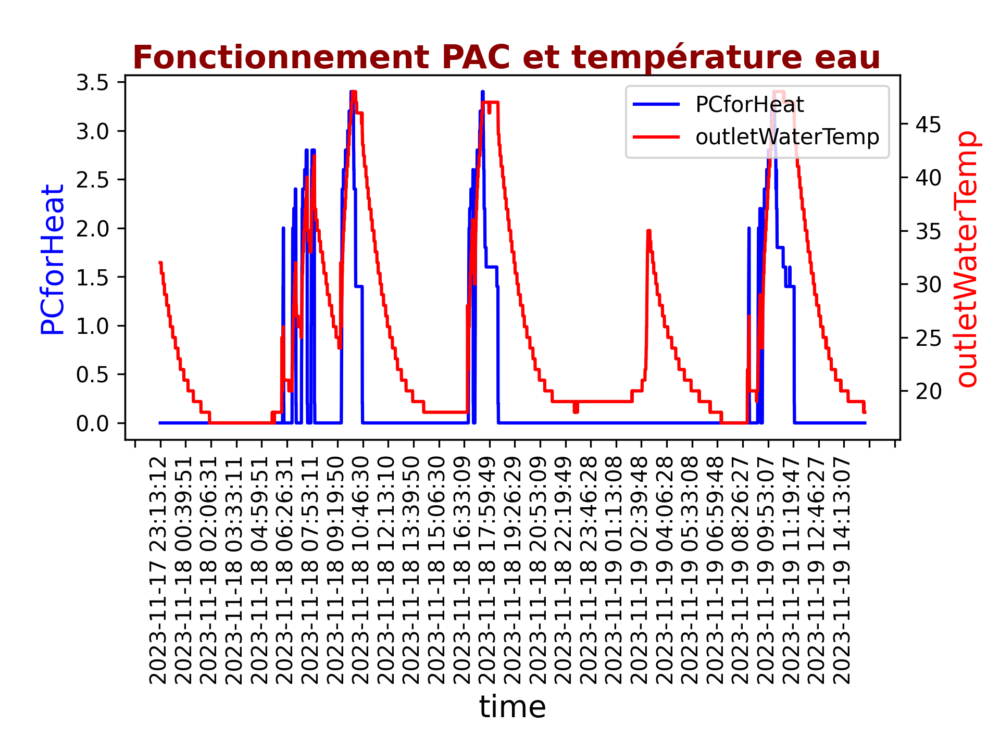
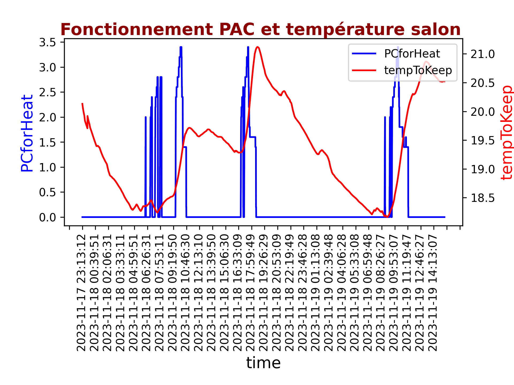

Etude des températures, de l'hygrométrie, du fonctionnement de la Pompe à Chaleur
pour optimisation de la consommation domestique.
==========
Ecriture d'un programme Python permettant de réaliser des visualisations concernant
l'évolution des températures et de l'hygrométrie d'une maison à partir de données brutes
recupérées via des capteurs au format csv pour les comparer aux données de fonctionnement
remontées de la PAC (fichier aquarea.raw).

La principale difficulté a été de rendre les données de la PAC utilisables
(format en 3 colonnes :une colonne "date", une colonne "time" et une colonne
ou toutes les données de fonctionnement sont concaténées) puis de concaténer
les deux dataframes (données relevées de température/hygrométrie et données PAC)
qui ont été relevées sur des périodes de temps différentes
( fichier aquareaVStempSalon2.csv).

Les deux premières lignes de données PAC tronquées (à l'origine 284 caractères):
2023-11-15 13:00:13 71C80110565552490055[...]0F816000100000100000D02010101010101000000AC
2023-11-15 13:00:39 71C80110565552490055[...]0F816000100000100000D02010101010101000000AC

Voici quelques exemples de graphiques obtenus après traitement des données:
-------------------------------
<table>
<tr>
<td></td>
<td></td>
</tr>
<tr>
<td>Fig1: Température extérieure et fonctionnement de la PAC </td>
<td>Fig2: Températures extérieure et intérieure </td>
</tr>
</table>
<table>
<tr>
<td></td>
<td></td>
</tr>
<tr>
<td>Fig1: Température des radiateurs et fonctionnement de la PAC </td>
<td>Fig2: Fonctionnement de la PAC et température intérieure </td>
</tr>
</table>
